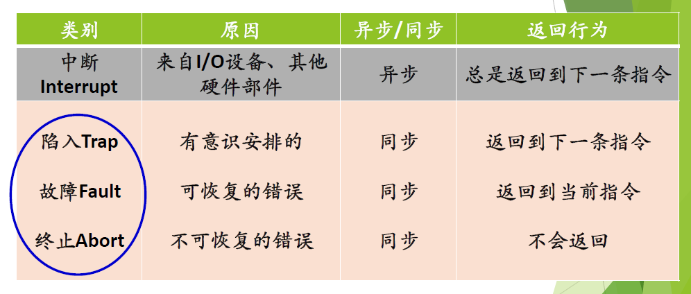
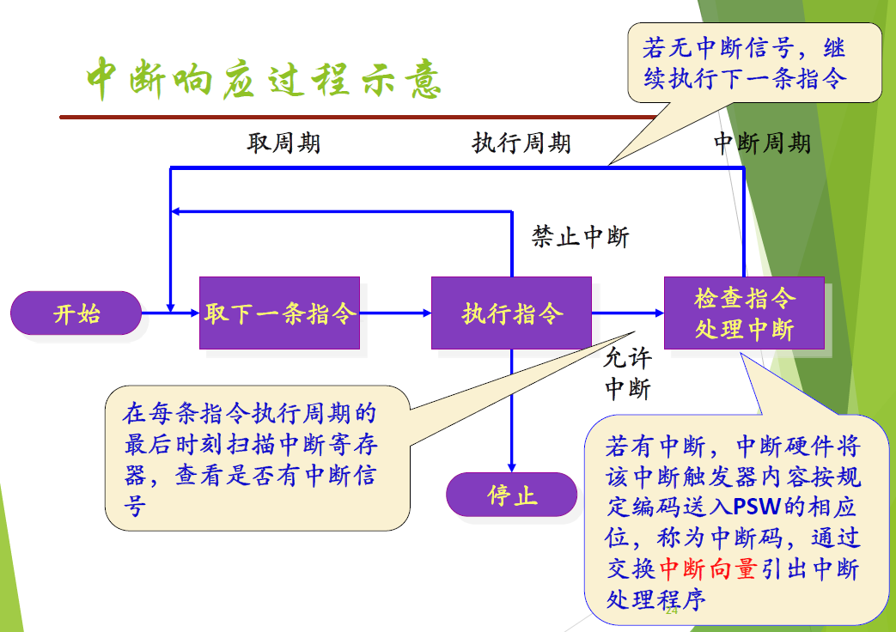
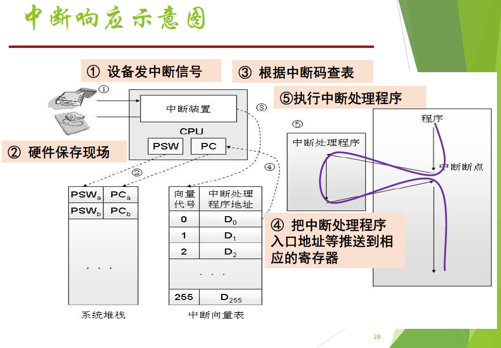

#### Ch 02  操作系统运行环境与运行机制

#### 中央处理器 $\rm CPU$

处理器由运算器、控制器、一系列的寄存器以及高速缓存构成

两类寄存器：**用户可见寄存器**、**控制和状态寄存器** 

1. **用户可见寄存器**：数据寄存器、地址寄存器、条件码寄存器
2. **控制和状态寄存器**：程序计数器$(\rm PC)$、指令寄存器、程序状态字 $(\rm PSW)$ 

##### 1. 操作系统的需求——保护

需要硬件提供机制：

1. 处理器具有特权级别，能在不同的特权级运行不同指令集合
2. 硬件机制可将 $\rm OS$ 与用户程序隔离

##### 2. 处理器的状态

在程序状态字寄存器 $(\rm PSW)$ 中进行设置

##### 3. 特权指令和非特权指令

+ **内核态**：运行操作系统程序
+ **用户态**：运行用户程序
+ **特权指令**：只能由操作系统使用、用户程序不能使用的指令
+ **非特权指令**：用户程序可以使用的指令

##### 4. $x86$ 处理器

支持 $4$ 个处理器特权级别：$R_0, R_1, R_2, R_3$. 

从 $R_0$ 到 $R_3$，特权级别从高到低

$R_0$ 为内核态，$R_3$ 为用户态

##### 5. $\rm CPU$ 状态之间的转换

**用户态 $\to$ 内核态**：

​			**唯一途径：中断/异常/陷入机制**

**内核态 $\to$ 用户态**：

​			**设置程序状态字 $\rm PSW(Program Status Word)$**

一条特殊指令：陷入指令（访管指令）

#### 中断/异常机制

主要作用：

1. 及时处理设备发来的中断请求
2. 可使 $\rm OS$ 可以捕获用户程序提出的服务请求
3. 防止用户程序执行过程中的破坏性活动

中断与异常引入的原因：

中断的引入：为了支持 $\rm CPU$ 和设备之间的并行操作

异常的引入：表示 $\rm CPU$ 执行指令时本身出现的问题

##### 1. 中断/异常的概念

$\rm CPU$ 对系统发生的某个事件作出的一种反应

$\rm CPU$ 暂停正在执行的程序，**保留现场**后**自动**转去执行相应事件的处理程序，处理完成后返回断点，**继续执行**被打断的程序

中断/异常是**随机发生的**，是**自动处理的**，是**可恢复的**。

中断是外部事件，正在运行的程序所不希望的

异常是由正在执行的指令引发的

#### 中断/异常机制工作原理

中断/异常机制是现代计算机系统的核心机制之一，通过**硬件与软件**相互配合

**硬件**需要完成**中断/异常响应** 

**软件**需要完成**中断/异常处理程序** 

##### 中断响应

中断响应是发现中断、接收中断的过程，由中断硬件部件完成

##### 中断向量表

中断向量是一个内存单元，存放**中断处理程序入口地址**和程序运行时所需的**处理机状态字**

##### 中断处理程序

设计操作系统时，为每一类中断/异常事件编好相应的处理程序，并设置好中断向量表。**软件提前设置好，硬件部件来执行**

系统运行时若响应中断，中断硬件部件将 $\rm CPU$ 控制权转给中断处理程序：

1. 保存相关寄存器信息
2. 分析中断/异常的具体原因
3. 执行对应的处理功能
4. 恢复现场，返回被事件打断的程序

##### 中断/异常机制小结

以设备输入输出为例：

1. 硬件：打印机给 $\rm CPU$ 发中断信号，$\rm CPU$ 处理完当前指令后检测到中断，判断出中断来源并向相关设备发确认信号
2. 硬件：$\rm CPU$ 开始为软件处理中断做准备，处理器状态切换到内核态，在系统栈中保存被中断程序的重要上下文环境，主要是 $\rm PC$ 和 $\rm PSW$ 
3. 硬件：$\rm CPU$ 根据中断码查中断向量表，获得与该中断相关的处理程序的入口地址，并将 $\rm PC$ 设置成该地址，新的指令周期开始时，$\rm CPU$ 控制转移到中断处理程序
4. 软件：中断处理程序开始工作，在系统栈中保存现场信息，检查 $\rm I/O$ 设备的状态信息，操纵 $\rm I/O$ 设备或者在设备和内存之间传送数据等
5. 硬件：中断处理结束时，$\rm CPU$ 检测到中断返回指令，从系统栈中恢复被中断程序的上下文环境，$\rm CPU$ 状态恢复成原来的状态，$\rm PSW$ 和 $\rm PC$ 恢复成中断前的值，$\rm CPU$ 开始一个新的指令周期

#### 系统调用机制工作原理

系统调用是用户在编程时可以调用的操作系统功能。系统调用是操作系统提供给编程人员的唯一接口，使 $\rm CPU$ 状态从**用户态**陷入**内核态**。

##### 系统调用机制的设计

中断/异常机制：支持系统调用服务的实现

选择一条特殊指令：陷入指令（或称访管指令）：引发异常，完成用户态到内核态的切换

系统调用号和参数：每个系统调用都事先给定一个编号（功能号）

系统调用表：存放系统调用服务例程的入口地址

参数传递过程问题。常用的 $3$ 种方式：

1. 由陷入指令自带参数：传递数量有限
2. 通过通用寄存器传递参数：受寄存器个数限制
3. 在内存中开辟专用堆栈区

##### 系统调用的执行过程

当 $\rm CPU$ 执行到特殊的陷入指令时：

**中断/异常机制**：硬件保存现场，通过查中断向量表把控制权转给系统调用总入口程序

**系统调用总入口程序**：保存现场；将参数保存在内核堆栈中，通过查系统调用表把控制权转给相应的系统调用处理例程或内核函数

**执行系统调用例程** 

**恢复现场，返回用户程序** 