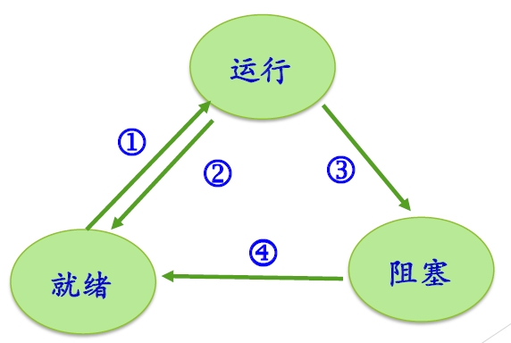
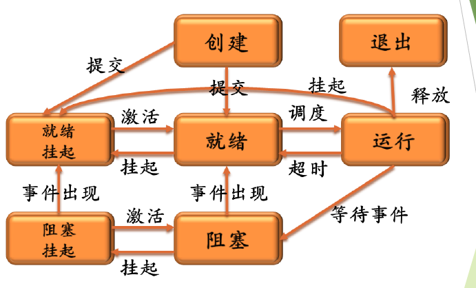

## Ch 03  进程线程模型

#### 多道程序设计

多道程序设计：允许多个程序**同时**进入内存并运行 $\to$ **提高系统运行效率** 

并发环境：一段时间间隔内，单处理器上有两个及以上程序**同时**处于**开始运行**但**尚未结束**的状态，**次序**不是事先确定的。宏观并行，微观串行。

#### 进程模型

**进程**是具有独立功能的程序关于**某个数据集合**上的**一次运行活动**，是系统进行**资源分配**和**调度**的独立单位

1. 进程是程序的一次执行过程（同一程序执行多次是多个进程）
2. 是正在运行程序的**抽象**
3. 进程是对 $\rm CPU$ 的**抽象**：将一个 $\rm CPU$ 变换成多个虚拟的 $\rm CPU$ 
4. 系统资源以**进程**为单位进行分配，**每个进程有独立的地址空间** 
5. 操作系统将 $\rm CPU$ **调度**给进程

##### 1. 进程的基本状态

进程的三种基本状态：**运行态**、**就绪态**、**等待态** 

**运行态**：占有 $\rm CPU$，并在 $\rm CPU$ 上运行

**就绪态**：已经具备运行条件，但由于没有空闲 $\rm CPU$，而暂时不能运行

**等待态**：因等待某一事件而暂时不能运行

##### 2. 进程状态之间的转换

进程在消亡之前处于且仅处于某一状态

不同系统设置的进程状态数不同

##### 3. 进程的其他状态

**创建**：已完成创建进程所必要的工作，但因资源有限还未同意执行

**终止**：进程终止后，完成一些数据统计资源回收的工作

**挂起**：将进程从内存转到磁盘用于调节负载

##### 4. 进程控制块 $\rm PCB$

$\rm PCB:Process \ Control \ Block$ 

1. 操作系统表示进程的一个专门的数据结构
2. 记录进程的各种属性，描述进程的动态变化过程
3. 又称**进程描述符**、**进程属性** 

操作系统通过 $\rm PCB$ 来控制和管理进程

​		$\rm PCB$ 是系统感知进程存在的唯一标志，进程与 $\rm PCB$ 一一对应

进程表是所有进程的 $\rm PCB$ 的集合

**$\rm PCB$** 的内容：

1. 进程描述信息：
	1. 进程标识符，唯一，通常为一整数
	2. 进程名
	3. 用户标识符，进程组关系
2. 进程控制信息：
	1. 当前状态
	2. 优先级
	3. 代码执行入口地址
	4. 程序的磁盘地址
	5. 运行统计信息（执行时间、页面调度）
	6. 进程间同步与通信；阻塞原因
	7. 进程的队列指针
	8. 进程的消息队列指针
3. 所拥有的资源和使用情况
	1. 虚拟地址空间的现状
	2. 打开文件列表
4. $\rm CPU$ 现场信息
	1. 寄存器值（$\rm PC, PSW$ 等）
	2. 指向赋予该进程的段/页表的指针

#### 三、进程控制

进程控制操作完成进程各状态之间的转换，由具有特定功能的**原语**完成

**原语**：完成某种特定功能的一段程序，具有不可分割性或不可中断性，原语的执行必须是连续的，执行过程中不能被中断。

##### 1. 进程的创建

+ 给新进程分配一个唯一**标识**以及**进程控制块** 

+ 为进程分配**地址空间** 

+ 初始化**进程控制块** 

+ 设置相应的**队列指针** 

##### 2. 进程的撤销

+ 结束子进程或线程

+ 收回进程所占有的资源

+ 撤销该进程的 $\rm PCB$ 

##### 3. 进程阻塞和进程唤醒

进程自己执行**阻塞原语**从**运行态**变为**阻塞态**。

#### 进程的讨论

**进程的分类**：系统进程/用户进程、前台进程/后台进程、$\rm CPU$ 密集型进程/$\rm I/O$ 密集型进程

**进程层次结构**

进程与程序之间的区别：

1. 进程更能准确刻画**并发**，而程序不能
2. 程序是静态的，进程是**动态**的
3. 进程有**生命周期**的，有诞生有消亡，是短暂的；程序是相对长久的
4. 一个程序可以对应多个进程
5. 进程具有创建其他进程的功能

**进程地址空间** 

#### 线程模型

##### 1. 线程的引入

1. 应用的需要
2. 开销的考虑
3. 性能的考虑

##### 2. 线程的基本概念

进程的两个基本属性：

1. **资源的拥有者** 进程仍然是资源的拥有者
2. **调度单位** 线程是进程中的一个运行实体，称为 $\rm CPU$ 的调度单位

将原来进程的两个属性分别处理

##### 3. 线程的属性

线程有状态及状态转换，不运行时需要保存的上下文，有自己的栈和指针

共享所在进程的地址空间和其他资源，可以创建、撤销另一个进程

#### 线程的实现

##### 1. 用户级线程

**内核**管理的是**进程**，线程切换不需要**内核态**特权

优点：

1. 线程切换快
2. 调度算法是应用程序特定的
3. 用户级线程可以运行在任何操作系统上

缺点：

1. 大多数系统调用是阻塞的，进程中所有的线程都被阻塞
2. 内核只将处理器分配给进程，两个线程不能同时运行在两个处理器上

##### 2. 核心级线程

内核管理所有线程管理，并向应用程序提供 $\rm API$ 接口

内核维护**进程**和**线程**的上下文

线程的切换需要**内核**支持

以**线程**为基础进行调度

##### 3. 混合—二者结合方法

线程创建在用户空间完成

线程调度等在核心态完成