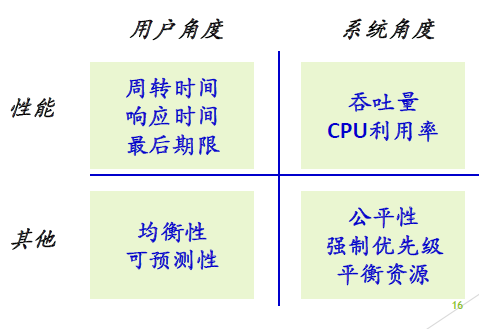
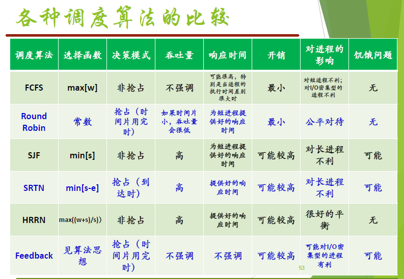

## Ch 04  进程线程调度

#### 处理器调度

处理器调度的三个层次：长程调度、中程调度、短程调度

处理器调度的任务是控制、协调进程对 $\rm CPU$ 的竞争，即按**一定的调度算法**从就绪队列中**选择一个进程**，把 $\rm CPU$ 的使用权交给被选中的进程。

如果没有就绪进程，系统会安排一个**系统空闲进程或 $\rm idle$ 进程** 

**调度程序**：挑选就绪进程的内核函数

$\rm CPU$ 调度的时机

1. **进程正常终止**或**由于某种错误而终止** 
2. **新进程创建**或**一个等待进程变成就绪** 
3. 当一个进程从**运行态**进入**阻塞态** 
4. 当一个进程从**运行态**进入**就绪态** 

调度过程——进程切换

进程调度程序从就绪队列选择了要运行的进程：这个进程可以是刚刚被暂停执行的进程，也可能是另一个**新的进程**。

**进程切换**：是指一个进程让出处理器，由另一个进程占用处理器的过程

主要包括：

1. **切换全局页目录**以加载一个**新的地址空间** 

2. **切换内核栈和硬件上下文**，其中硬件上下文包括了内核执行新进程所需要的全部信息，如 $\rm CPU$ 相关寄存器

切换过程包括了对原来运行进程各种状态的保存和对新的进程各种状态的恢复

上下文切换开销

直接开销：内核完成上下文切换所花费的时间

+ 保存和恢复寄存器
+ 切换地址空间

间接开销：高速缓存、缓冲区缓存、$\rm TLB$ 失效

#### 处理器调度算法的设计

##### 调度算法衡量指标

**吞吐量**：每单位时间完成的进程数目

**周转时间**：每个进程从提出请求到运行完成的时间

**响应时间**：从提出请求到第一次回应的时间

$\rm CPU$ **利用率**：$\rm CPU$ 做有效工作的时间比例

**等待时间**：每个进程在就绪队列中等待的时间

##### 1. 进程优先级

**静态优先级**：进程创建时指定，运行过程中不再改变

**动态优先级**：进程创建时指定了一个优先级，运行过程中可以动态变化

##### 2. 进程就绪队列

##### 3. 抢占与非抢占

**可抢占式**：当有比正在运行的进程优先级高的进程就绪时，系统可**强行剥夺正在运行的 $\rm CPU$**。

**不可抢占式**：某一进程被调度运行后，除非因自身的原因不能运行，否则一直运行。

##### $4.$ 两种线程

$\rm I/O$ 密集型或 $\rm I/O$ 型

$\rm CPU$ 密集型或计算密集型

##### 5. 时间片

一个时间段，分配给调度上 $\rm CPU$ 的进程，确定允许该进程运行的时间长度

#### 处理机调度算法

##### 先来先服务调度算法 FCFS

按照进程就绪的顺序使用 $\rm CPU$、没有抢占

公平简单、资源利用率较低

##### 最短作业优先 $\rm SJF$

具有最短完成时间的进程优先执行

非抢占式

先完成短作业，改善短作业的周转时间

缺点：可能导致长任务的饥饿

##### 最短剩余时间优先 $\rm SRTN$

抢占式 $\rm SJF$ 

##### 最高响应比优先$\rm HRRN$

计算每个进程的响应比 $\rm R$ 

总是选择响应比最高的进程

响应比 $=$ $1 + $ 等待时间/处理时间

#### 交互式系统中采用的调度算法

##### 轮转调度 $\rm RR$ 

周期性任务切换

每个进程分配一个时间片

时钟中断 $\to$  轮换

时间片太长：变为 $\rm FCFS$ 

时间片太短：进程切换浪费 $\rm CPU$ 时间

#### 最高优先级调度算法

选择优先级最高的进程进行运行

操作系统更偏好 **$\rm I/O$ 型进程** 

优先级反转

一个低优先级进程持有一个高优先级进程所需要的资源，使高优先级进程等待低优先级进程运行。导致系统性能下降。

#### 多级反馈队列调度算法

多个就绪队列，优先级不同。不同队列时间片不同，采用**时间片轮转调度**算法调度

