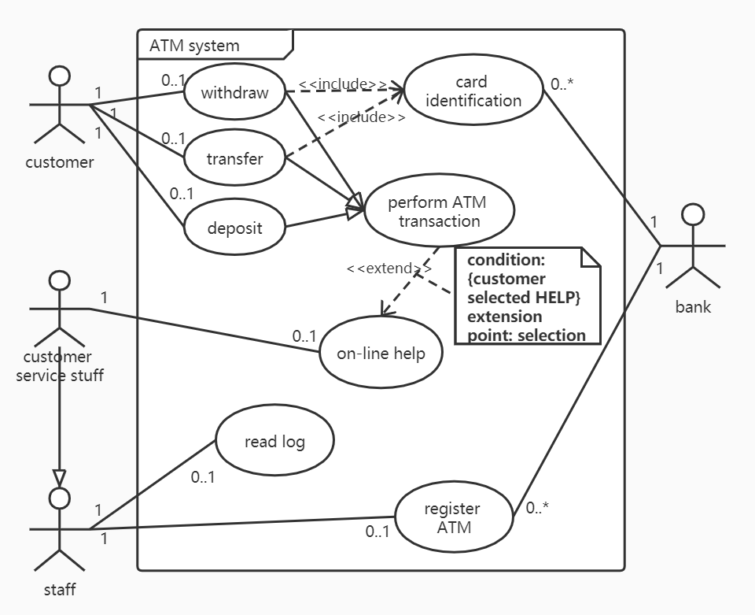

## Ch 03  软件需求与软件需求规约

#### 需求

**需求与需求获取**：一个需求是一个陈述，描述了待开发产品/系统功能上的能力、性能参数或者其他性质。

**需求的五个基本性质**

1. **必要的**：是要求的吗？
2. **无歧义的**：只能用一种方式解释吗？
3. **可测的**：可以对它进行测试吗？
4. **可跟踪的**：可以从一个开发阶段到另一个开发阶段对它进行跟踪吗？
5. **可测量的**：可以对它进行测量吗？

**软件需求的分类**

1. **功能需求**：规约了系统或系统构件必须执行的功能
2. **性能需求**：规约了一个系统或系统构件必须具有的性能特性
3. **外部接口需求**：规约了系统或系统构件必须与之交互的硬件、软件或数据库元素
4. **设计约束**：限制了系统或系统构件的设计方案
5. **质量属性**：规约了软件产品必须具有的一个性质是否达到质量方面一个所期望的水平

外部接口分为：

1. 系统接口、用户接口、硬件接口、软件接口、通讯接口、内存约束、操作、地点需求

**需求发现技术** 

1. **自悟**：需求人员把自己作为系统的最终用户，审视系统并提出问题寻找需求
2. **交谈**：需求人员提出问题，用户回答，得到需求
3. **观察**：观察用户执行现行的任务和过程，得到需求
4. **小组会**：举行客户与开发人员的回忆，与客户代表开发需求
5. **提炼**：复审技术文档，提炼出需求

**软件需求规约** 

**软件需求规约**：**一个软件需求规约是一个软件项/产品/系统所有需求陈述的正式文档，是一个软件产品/系统的概念模型** 

**软件需求规约**的基本性质：

1. 重要性和稳定性程度
2. 可修改的
3. 完整的
4. 一致的

**需求规约的三种风格** 

1. 非形式化的规约
2. 半形式化的规约
3. 形式化的规约

###### 需求规约的作用

1. 作为软件开发组织和用户之间一份事实上的技术合同书，是产品功能及其环境的体现
2. 对于项目的其余大多数工作，它是一个管理控制点
3. 对于产品的设计，是一个正式的、受控的起始点
4. 是创建产品验收测试计划和用户指南的基础

#### 用况

需求获取技术：用况图给出了操作者和用况以及他们之间的关系。

**用况**：（使用视角）表达了参与者使用系统的一种方式，（系统设计视角）规约了系统可以执行的一个动作序列

**用况之间的关系**：

1. **关联**：参与关系，操作者**参与**一个用况。**关联是操作者和用况之间的唯一关系**，使用**直线**表示
2. **扩展**：用况A到用况B的**扩展**，指出用况B的一个实例可以由A说明的行为予以扩展，并依据该扩展点定义的位置，A说明的行为被插入到B中，使用**带 $<<\rm extend>>$ 的虚线箭头**表示 
3. **包含**：用况A到用况B的一个包含，指出A的一个实例将包含B说明的行为，即这一行为将包含在A定义的那部分中，使用**带 $<<\rm include>> $ 的虚线箭头**表示
4. **泛化**：用况A到用况B的泛化，指出A是B的特殊情况，使用**直线空心箭头**表示

#### 用况图

**用况图**是一种表达系统功能模型的图形化工具。用况图给出了操作者和用况以及它们之间的关系。

主题：是由一组用况所描述的一个系统或子系统