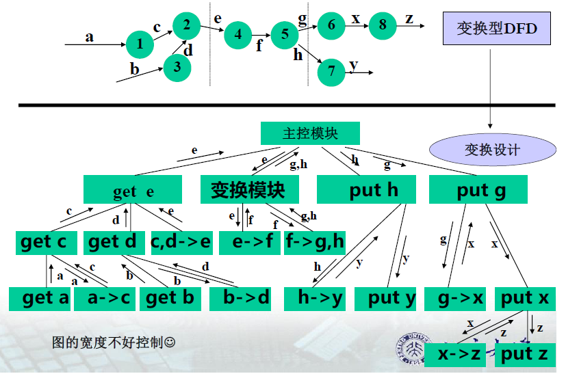
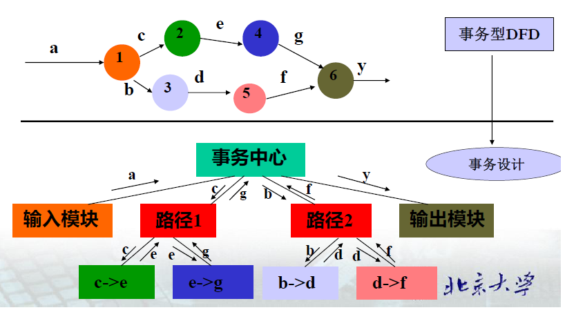

## Ch 05  结构化设计

设计：一种软件开发活动，定义实现需求规约所需的软件结构

设计目标：依据需求规约，在一个抽象层上建立系统软件模型，包括软件体系结构（数据和程序结构）、详细的处理算法，产生设计规格说明书

**结构化设计**分为**总体设计**和**详细设计** 

1. **总体设计**：确定系统的整体模块结构，即系统实现所需要的软件模块以及这些模块之间的调用关系
2. **详细设计**：详细描述模块

##### 3. 结构化设计方法

###### 1. 总体设计层

1. 引入两个术语/符号：
	1. **模块**：一种可独立标识的软件成分，标识为**方框** 
	2. **调用**：模块间的一种关系，某模块为了完成功能必须依赖其他模块，表示为**线段** 
2. 引入了**模块结构图**（$\rm MSD$ 图）
	1. 用于表达软件系统的**静态结构**。
3. 过程指导：
	1. 总体设计的任务是将 $\rm DFD$ 转化成 $\rm MSD$ 

总体设计分为三个阶段：

1. 初始设计：在对给定的数据流图进行复审和精化的基础上，将其转化为初始的模块结构图。根据穿越系统边界的数据流图初步确定系统与外部的**接口** 
2. 精化设计：依据“**高内聚低耦合**”原则，精化初始的模块结构图，并设计其中的全局数据结构和每一模块的接口
3. 设计复审阶段，对前两个阶段得到的高层软件结构进行复审，必要时还可能需要对软件结构做一些精化工作

##### 4. 总体设计第一步：

$\rm DFD \to $ 初始的 $\rm MSD$ 

###### 数据流图分类：

**变换型数据流图**：具有较明显的**输入部分和变换部分之间的界面**、**变换部分和输出部分之间界面**的数据流图。

1. 逻辑输入：离物理输入最远、仍被看作系统输入的数据流
2. 逻辑输出：离物理输出最远、仍被看作系统输出的数据流

**事务型数据流图**：数据到达一个加工，该加工根据输入数据的值，在其后的若干动作序列（称为一个事务）中选出一个来执行，这类数据流图称为事务型数据流图。

事务型数据流图完成的任务：

1. 接受输入数据
2. 分析并确定对应的事务
3. 选取与该事务对应的一条活动路径

事务型数据流图和变换型数据流图的区别

1. 所有数据流图都可以看做是变换型数据流图
2. 一般而言，接受一个输入数据，分成多条路径

###### 变换设计的基本步骤

1. 设计准备—复审并精化系统模型

	1. 为了确保系统的输入数据和输出数据符合实际情况而复审语境
	2. 为了确保是否需要进一步精化系统的数据流图而复审语境

2. 确定输入、变换、输出三部分之间的边界

	1. 根据加工的语义和相关的数据流，确定系统的**逻辑输入**和**逻辑输出** 

3. 第一级分解—系统模块结构图顶层和第一层的设计

	1. 主模块：最顶层，一般以所建系统的名字命名，任务是协调控制第一层模块
	2. 输入模块部分：为主模块提供加工数据，有几个逻辑输入就设计几个输入模块
	3. 变换模块部分：接受输入模块部分的数据，并对内部形式的数据加工，产生系统所有的内部输出数据
	4. 输出模块部分：将变换模块产生的输出数据，以用户可见的形式输出，有几个逻辑输出就设计几个输出模块。

4. 第二级分解—自顶向下，逐步求精

	对每一个输入模块设计其下层模块

	1. 输入模块
	2. 把接收的数据变换成它的上级模块所需的数据（变换模块）
	3. 指导输入模块为物理输入，则细化停止

	对每一个输出模块设计其下层模块

	1. 将得到的数据向输出形式进行转换
	2. 将转换后的数据进行输出
	3. 直到输出模块是物理输出，细化停止。

	对变换模块进行分解（无通用法则）

###### 事务设计的基本步骤

1. 设计准备—复审并精化系统模型
	1. 为了确保系统的输入数据和输出数据符合实际情况而复审语境
	2. 为了确保是否需要进一步精化系统的数据流图而复审语境
2. 确定事务处理中心
3. 第一级分解—系统模块结构图顶层和第一层的设计
	1. 首先为事务中心设计一个主模块
	2. 为每一条活动路径设计一个事务处理模块
	3. 对其输入部分设计一个输入模块
	4. 如果一个事务数据流图的活动集中于一个加工，则涉及一个输出模块，否则第一层不设计输出模块
4. 第二级分解—自顶向下，逐步求精
	1. 对于输入模块、输出模块的细化，与变换设计相同
	2. 对各路径模块的细化，无设计法则。

##### 四、总体设计第一步

$\rm DFD \to$ 初始的 $\rm MSD$ 

1. 一个系统的 $\rm DFD$，通常是**变换型数据流图**和**事务型数据流图**的组合
2. 自动的变换设计
3. 自动的事务设计

##### 五、总体设计第二步

将初始的 $\rm MSD$ 转化为最终可供详细设计使用 $\rm MSD$ 

概念：模块、模块化

基于模块化原理：**高内聚**、**低耦合**原则

给出设计规则—经验规则—启发式规则

用于精化初始的 $\rm MSD$ 

体现设计人员的创造

##### 模块和模块化

**模块**：执行一个特殊任务的一组例程和数据结构

1. **接口**：给出可由其他模块和例程访问的对象
2. **实现**：模块功能的执行机制

**模块化**：把系统分解成若干模块的过程

模块化的评价：高内聚，低耦合

**耦合**：**不同模块之间相互依赖程度的度量** 

1. 耦合强度所依赖的因素：两个模块间引用、传递的数据量

耦合类型（从强到弱）

1. **内容耦合**：一个模块直接修改或操作另一个模块的数据
2. **公共耦合**：两个以上的模块共同引用一个全局数据项
3. **控制耦合**：一个模块向另一个模块传递一个控制信号，接受信号的模块将依据该信号值进行必要的活动
4. **标记耦合**：两个模块至少有一个通过界面传递的公共参数，包括内部结构，如数组、字符串等
5. **数据耦合**：模块间通过**参数**传递基本类型的值

原则：**如果模块间必须有耦合，尽量使用数据耦合，少用控制耦合，限制公共耦合的范围，坚决避免使用内容耦合**。

**内聚**：**一个模块之内各成分之间相互依赖的程度的度量** 

好的设计需要：

1. 模块的功能单一
2. 模块的各部分都和某块的功能直接相关
3. 高内聚

内聚类型（由低到高）

1. **偶然内聚**：一个模块之内各成分之间无任何关系
2. **逻辑内聚**：几个逻辑上相关的功能放在同一模块下
3. **时间内聚**：一个模块完成的功能必须在同一时间内完成，而这些功能只是因为时间因素联系在一起
4. **过程内聚**：处理成分必须以特定的次序执行
5. **通信内聚**：各成分都操作在同一数据集或生成同一数据集
6. **顺序内聚**：各成分与一个功能相关，一个成分的输出作为另一成分的输入
7. **功能内聚**：模块的所有成分对完成单一功能是最基本的，且该模块对完成这一功能而言是充分必要的

#### 启发式规则

从长期的软件开发实践中总结的准则。既不是设计目标，也不是设计时应该普遍遵循的原理

1. 改进软件结构，提高模块独立性
2. 模块规模适中，每页 $60$ 行语句
3. 深度、宽度、扇入和扇出适中
4. 模块的作用域力争在控制域之内
5. 降低模块接口的复杂性
6. 模块功能应该可以预测

## 接口设计

#### 接口设计的分类

系统的接口设计（包括用户界面设计及与其他系统的接口设计）是由穿过系统边界的数据流定义的。

在最终的系统中，数据流将成为用户界面中的表单、报表或与其他系统进行交互的文件或通信

用户界面应当具备的特性

1. **可使用性**：用户界面设计最重要的目标。使用简单、界面一致
2. **灵活性**：对不同的用户，有不同的界面形式
3. **可靠性**：用户界面的可靠性指的是无故障使用的间隔时间

用户类型

1. 外行型：对计算机认知很少或毫无了解
2. 初学型：对计算机有一定经验，对系统的认识不足或经验很少，**需要很多界面支持** 
3. 熟练型：对一个系统有很多经验，**需要较少的界面支持，但不能处理意外错误** 
4. 专家型：了解系统的内部构造，**需要为他们提供能够修改和扩充系统能力的复杂界面** 

#### 详细设计层

详细设计的任务：定义每一模块

+ 主要引入了关于三种动作控制结构的术语/符号
+ 三种控制结构：顺序，选择和循环

结构化程序设计的概念

一个程序的代码块仅仅通过顺序、选择和循环三种基本控制结构进行连接，每个代码块都只有一个入口和一个出口

第一种表达—伪码（$\rm PDL, \ Program \ Design \ Language$）

第二种表达—程序流程图（程序框图）

第三种表达—$\rm PAD$ 图（$\rm Problem \ analysis \ Diagram$）

第四种表达—$\rm N - S$ 图

#### 三、软件设计规约（软件设计说明书）

**软件设计规约**对软件的组织或其组成部分的内部结构的描述，满足系统需求规约所指定的全部功能及性能要求。

软件设计规约通常有**概要设计规约**和**详细设计规约**，分别为相应设计过程的输出文档。

**概要设计规约**指明软件的组织结构。软件概要设计是面向软件开发者的文档，主要作为软件项目管理人员、系统分析人员与设计人员之间交流的媒体。

**详细设计规约**是对软件各组成部分内部属性的描述，是概要设计的细化。

软件设计规约主要作为**软件设计人员与程序员之间**交流的媒体。

#### 四、软件设计评审

**设计评审**：对设计文档的评审。对于软件设计来说，评审与其技术设计方法本身是一样重要的，评审对于研制项目的成功而言是绝对必要的