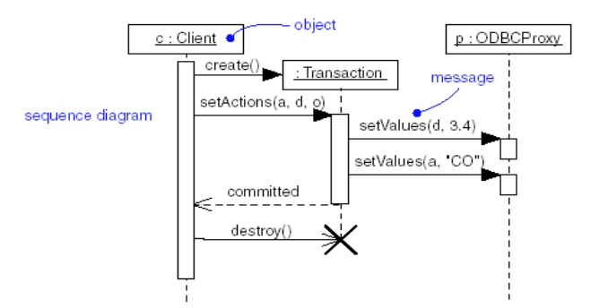
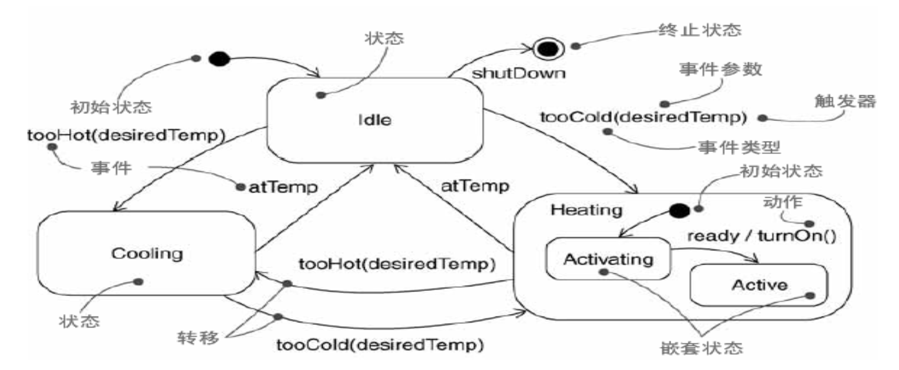

## Ch 06  面向对象方法

面向对象方法—一种特定的软件开发方法学

**面向对象方法**是一种以**对象**、**对象关系**等来构造软件系统模型的系统化方法。

面向对象方法的世界观：一切系统都是由对象构成的，它们的相互作用、相互影响，构成了大千世界的各式各样系统。

面向对象方法形成了以下两个学派：

第一种：以**方法**驱动的方法学。

第二种：以**模型**驱动的方法学。

##### 面向对象不仅仅是一种程序开发方法

+ 使用面向对象程序设计语言
+ 使用对象、类、继承、封装、消息等基本概念进行编程

##### 面向对象是一种软件方法学

+ 如何看待软件系统与现实世界的关系
+ 以什么观点进行求解
+ 如何进行系统构造

##### 面向对象方法的主要特点

1. 从问题域中客观存在的事物出发来构造软件系统：
	1. 用**对象**（系统中用来描述客观事物的一个实体）作为对这些事物的抽象表示，并以此作为**系统的基本构成单位** 
	2. 事物的**静态特征**用对象的**属性**表示
	3. 事物的**动态特征**（对象的行为）用对象的**操作**表示
2. 对象的属性和操作结合为一体，构成一个独立的实体，对外屏蔽内部细节（**封装**）
3. 对事物进行**分类**，把具有相同属性和相同操作的对象归为一类，**类**是这些对象的抽象描述，每个对象是它的类的一个**实例** 
4. 通过在不同程度上运用**抽象**的原则，可以得到较一般的类和较特殊的类。特殊类**继承**一般类的属性和操作，面向对象方法支持对这种继承关系的描述和实现，从而简化系统的构造过程及其文档
5. 复杂的对象可以用简单的对象作为其构成部分（**聚合**）
6. 对象之间只能通过**消息**进行通信（不允许一个对象直接使用另一个对象的属性），以实现对象之间的动态联系
7. 用**关联**表达类之间的静态关系

##### 面向对象的基本思想

+ 从现实世界中客观存在的事物出发建立软件系统
+ 充分运用人类日常的思维方法

#### $\rm UML$

$\rm UML$ 是一种可视化语言，用于

1. **规约**系统的制品——$\rm UML$ 适用于对所有重要的分析、设计和实现决策进行详细描述
2. **构造**系统的制品——$\rm UML$ 描述的模型可与各种编程语言直接相关联

$\rm UML$ 应用范围

1. 可用于对象方法和构件方法
2. 可用于所有应用领域、不同的实现平台

$\rm UML$ 是系统分析和设计的工具

$\rm UML$ 作为一种半形式化语言，给出了方法学中可用于不同抽象层次的术语表，给出了表达各种模型的表达格式

1. 需求获取层：使用用况图
2. 需求分析层：使用类图、交互图
3. 设计层：使用类图、交互图

##### 面向对象方法术语/符号

为了支持软件开发，面向对象方法主要提供了两类术语：

一类是结构化地表达客观事物的术语

一类是表达客观事物之间关系（相互作用/相互影响）的术语

1. 为了控制信息组织和文档组织的复杂性，引入了用于组织特定对象结构的**包**。包是模型元素的一个分组，一个包本身可以嵌套在其他包中，并且可以具有子包和其他种类的模型元素
2. 为了使建造的系统模型容易理解，引入了**注解**，用于对模型增加一些辅助性说明

#### 类和对象——体现数据抽象

**类**：是**一组具有相同属性、操作、关系和语义的对象的描述** 

**对象**：对象是类的一个实例

类可表示为具有三个栏目的矩形：**名称**、**属性**、**操作** 

类可以是抽象类，即没有实例的类，此时类名采用斜体字

类名（类的标识）

1. 类名使用黑体字，第一个字母通常要大写，并位于第一栏的中央
2. 类名往往是从正被建模系统的词汇表中提取的简单名词或名词短语

属性：

属性是类的一个命名特性，由该类的所有对象所共享，用于表达对象状态的数据。

1. 一个属性往往具有所属的类型，用于描述该特性的实例可以取值的范围
2. 类的一个对象对每一个属性应有特定的值
3. 一个类可以由多个属性，也可以没有属性

属性的作用范围：

1. **实例范围的属性**：一个类的所有对象具有相同的属性即属性的个数、名称、数据类型相同，但属性值可能不同，并随程序的执行而变化
2. **类范围的属性**：描述类的所有对象共同特征的一个数据项，对于任何对象实例，它的属性值都是相同的，通常对属性加下划线来表示该属性为类范围的属性

定义属性的格式为：

$[$可见名$]$属性名$[:$类型$][$多重性$][=$初始值$][\{$特性串$\}]$ 

1. **可见性**：表明该属性是否可以被其他类所使用

2. **属性名**：属性名是一个表示属性名字的标识串，通常以小写字母开头，左对齐

3. **类型**：类型是对属性实现类型的规约，与具体实现语言有关

4. **多重性**：多重性用于表达属性值的数目

	​				多重性是可以省略的，属性只含一个值

5. **初始值**：初始值是与语言相关的表达式，用于为新建立的对象赋予初始值

6. **性质串**：性质串是为了表达该属性所具有的性质而给出的。

**操作**：操作是对一个类中所有对象要做的事情的抽象

操作的格式：$[$可见性$]$操作名$[$（参数表）$][:$返回类型$][\{$性质串$\}]$ 

1. 一个类可以有多个操作，也可以没有操作
2. 操作名除第一个词外，其它每个词的第一个字母要大写
3. 操作名往往是描述其所在类的行为的动词或动词短语
4. 可以通过给出操作的标记特征进一步描述之，特征标记通常包括参数名、类型和默认值；如果操作是一个函数，其特征标记还包括返回类型
5. 操作可以是抽象操作，即没有给出实现的操作。此时操作名采用斜体。
6. 调用一个对象上的操作可能会改变该对象的数据或状态。

##### 类的责任

类的责任：在模型化一类事物中，其起始点往往是给出该类的责任，即一个类承诺的任务或指责

类的责任是由类中定义的属性和操作实现的。在精化类当中，需将责任转换为一组能够很好地完成责任的属性和操作

在规约类时，为了使该类具有更多的语义信息，除了规约以上提到的责任、属性和操作外，有时还需要规约类的其他特征，例如属性和操作的可见性，操作的多态性。

##### 操作的多态性

##### 类在建模中的主要用途

1. 模型化一个系统中的词汇

	+ 识别用户或实现者用于描述问题或者描述解决方案的那些事物，将其表示为类。使用用况分析。

2. 模型化系统中的责任分布（对系统中的责任分布建模）

	目的：均衡每一个类的责任，避免过大或过小

	+ 过大—难以复用
	+ 过小—难于理解和管理

3. 模型化基本类型（对基本类型建模）

**主动类**：体现并发行为抽象

**主动对象**：至少有一个操作不需要接收消息就能主动执行的对象，用于描述具有主动行为的事物

主动对象的类叫做主动类

#### 接口——体现功能抽象

**接口**：是一组**操作**的集合，其中每个操作描述了类或构件的一个服务。接口定义的是一组操作的**描述**，而不是操作的实行

接口的基本作用：模型化系统中的“接缝”

接口的表示

1. 使用带有**分栏**和**关键字 $<<\rm interface>>$ 的矩形符号**来表示接口。

2. 可以用小圆圈表示接口

	1. 把从类到它实现的接口的实现关系显示为**带有实三角箭头的虚线** 
	2. 用**带有 $<<\rm use>>$ 标记的虚线箭头**表示使用

3. 接口只描述类的外部可见操作，并不描述内部结构

4. 接口仅描述一个特定类的有限行为。接口没有实现，接口也没有属性、状态或者关联，接口只有操作。

	接口在形式上等价于一个**没有属性而只有抽象操作的抽象类** 

5. 接口只可以被其它类目使用，而其本身不能访问其他类目

6. 接口之间没有关联、泛化、实现和依赖，但可以参与**泛化**、**实现**和**依赖**关系

#### 协作——体现行为结构抽象

**协作**是一组类、接口和其他元素的群体，他们共同工作以提供比各组成部分的总和更强的合作行为

协作是一个交互，涉及交互三要素：交互各方、交互方式以及交互内容。交互各方的共同工作提供了某种协作方式

1. 协作有两个方面，一个是**结构部分**，经常用**组合结构图**或**类图**来表示；二是行为部分，详细说明这些元素如何交互，经常用**交互图**来表示
2. 由于一个给定的类或对象可以参与多个协作，因此**协作**表现了**系统细化**的构成模式

#### 用况——体现功能抽象

是对一组动作序列的描述，系统执行这些动作产生对特定的参与者一个有值得、可观察的结构

1. 用况用于模型化系统中的行为，是建立系统功能模型的重要术语。一个用况描述了系统的一个完整的需求
2. 用况是通过**协作**予以细化的

#### 主动类——提现并发行为抽象

1. 是一种至少具有一个**进程或线程**的类，因此它能够启动控制活动
2. 主要特性：主动类对象的行为通常与其他对象的行为是**并发**的

#### 构件

构件是系统中逻辑的并且可替换的成分，它遵循并提供了一组接口的实现

1. 在一个系统中，共享相同接口的构件可以相互替代，但其中要保持相同的逻辑行为
2. 构件可以包含更小的构件

#### 制品

**制品**：系统中物理的、可替代的部件，其中包含物理信息

1. 在一个系统中，可能会存在不同类型的部署制品，例如源代码文件、可执行程序和脚本等
2. 制品通常代表对源代码信息或运行时信息的一个物理打包

#### 节点

**节点**：是在运行时存在的物理元素，通常表示一种具有记忆能力和处理能力的计算机资源

1. 一个构件可以驻留在一个节点中，也可以从一个节点移到另一个节点

$\rm UML$ 中，将类、接口、协作、用况、主动类、构件、制品、节点统称为**类目**，它们是可包含在一个 $\rm UML$ 模型中的基本模型化元素

#### 包

包是模型元素的一个分组，一个包本身可以被嵌套在其他包中，可以含有子包和其他种类的模型元素，这些模型元素可以是类、接口、构件、节点、用况等

表示

1. 通常在大矩形中描述包的内容，而把该包的名字放在**左上角的小矩形**中
2. 可以把所包含的元素画在包的外面，将这些元素与该包相连，这时可把该包的名字放在大矩形中

###### 注解—可用于解释信息的术语

为了使建造的系统模型容易理解，引入注解，对模型增加一些辅助性说明

#### 表达关系的术语

在 $\rm UML$ 中，提供下列 $4$ 种关系作为 $\rm UML$ 模型中的基本关系构造块，表达类目之间的关系，构造一个结构良好的 $\rm UML$ 模型

1. 关联
2. 泛化
3. 实现
4. 依赖

#### 关联

**关联是类目之间的结构关系，描述了一组具有相同结构、相同语义的链**（$\rm links$）。

**链**是**对象之间的连接** 

如一个关联只连接两个类目，称为二元关联

如一个关联连接 $n$ 个类目，称为 $n$ 元关联

关联的语义表达：

1. 关联名：关联的标识，用于描述关联的“涵义”。为避免歧义，可给出关联方向

2. 角色名：一个类参与一个关联的角色标识，可显式命名

3. **多重性**：类中对象参与一个关联的数目，称为该关联对象角色的多重性

4. 聚合：一种特殊形式的**关联**，表达一种“整体/部分”关系

	组合：**如果整体类的实例和部分类的实例具有相同的生命周期，这样的聚合称为组合** 

5. 限定符：一个限定符是一个关联的属性或属性表，这些属性的值将对该关联相关的对象集做了一个划分

6. 关联类：一种模型元素，它有关联和类的特性。一个关联类，可以被看做是一个关联，但还有类的特性；或被看做是一个类，但有关联的特性

#### 泛化

泛化是**一般性类目**（超类或父类）和它的**较为特殊性类目**（子类）之间的一种关系，称为“$\rm is \ a \ kind \ of$”关系

1. 子类可继承父类的属性和操作，并可有更多的属性和操作
2. 子类可以替换父类的声明
3. 若子类的一个操作的实现覆盖了父类同一个操作的实现，这种情况被称为多态性，但两个操作必须具有相同的名字和参数
4. 一个类可以有 $0$、$1$ 个或多个父类。没有父类且最少有一个子类的类被称为根类或基类；没有子类的类称为叶子类。如果一个类只有一个父类，则说它使用了**单继承**；如果一个类有多个父类，则说明它使用了**多继承** 

**泛化**使用**带空三角箭头的直线**表示

#### 聚合

一种特殊形式的关联，表达一种“整体/部分”关系。即一个类表示了一个大的事物，它是由一些小的事物组成的

组合是聚合的一种形式，其部分和整体属于很强的“属于”关系，整体类的对象管理部分类的对象，决定部分类的对象何时属于它，何时不属于它。

**聚合**使用**带菱形箭头的直线**表示

#### 细化（实现）

**细化是类目之间的一种语义关系，其中一个类目规约了保证另一个类目执行的契约**。

在以下两个地方会使用细化关系：

1. **接口与实现它们的类和构件**之间
2. **用况与实现它们的协作**之间

**细化**使用**带空三角箭头的虚线**表示

#### 依赖

**依赖是一种使用关系，用于描述一个事物使用另一事物的信息和服务** 

1. 在大多数情况里，使用**依赖**来描述一个类使用另一个类的操作
2. 如果被使用的类发生变化，那么另一个类的操作也会受到影响
3. 依赖可用于其他事物之间，例如注解之间和包之间

**依赖**使用**一条有向虚线**表示

## 关于 $\rm UML$ 的图：表达格式—模型表达工具

$\rm UML$ 为不同抽象层提供了 $6$ 种可对**系统静态部分**建模的图形工具：

1. **类图**：类图显示了类及其接口、类的内部结构以及与其他类的联系。**是面向对象分析与设计所得到的最重要的模型**。
2. **构件图**：在转入实现阶段之前，可以用它表示如何组织构件。构件图描述了构件及构件之间的依赖关系。
3. **组合结构图**：展示了类或协作的内部结构。
4. **对象图**：展示了一组对象以及它们之间的关系。用对象图说明在类图中所发现的事物的实例的数据结构和静态快照。
5. **部署图**：部署图展示运行时进行处理的结点和在结点上生存的制品的配置。部署图用来对系统的静态部署视图建模。
6. **制品图**：展示了一组制品以及其之间的依赖关系。利用制品图可以对系统的静态实现视图建模。

$\rm UML$ 为不同抽象层提供了 $7$ 种可对**系统动态部分**建模的图形工具：

1. **用况图**：**需求模型** 
2. **状态图**：当对象的行为比较复杂时，可用状态图作为辅助模型描述对象的状态及其状态转移，从而**更准确地定义对象的操作** 
3. **活动图**：注重从活动到活动的控制流，可用来描述对象的操作流程，也可以描述**一组对象之间的协作行为或用户的业务流程** 
4. **顺序图**：注重于消息的时间次序。可**用来表示一组对象之间的交互情况** 
5. **通信图**：注重于收发消息的对象的组织结构。可用来表示一组对象之间的交互情况
6. **交互概况图**：用于描述系统的宏观行为，是活动图和顺序图的混合物
7. **定时图**：用于表示交互，展现了消息跨越不同对象或角色的实际时间，而不仅仅关心消息的相对顺序

#### 类图——静态模型表达工具

类图显示了类及其接口、类的内部结构以及与其他类的联系。**是面向对象分析与设计所得到的最重要的模型**。

作用：可视化地表达系统的静态结构模型

类图的内容：

+ 类、接口；依赖、泛化、关联关系等
+ 注解和约束、包、子系统等

类图主要用于对系统的静态视图进行建模，支持表达系统的功能需求，即系统提供给最终用户的服务。

创建类图的过程：

1. 对系统中的概念（词汇）建模，形成类图中的基本元素

	使用 $\rm UML$ 中的术语“类”，来抽象系统中各个组成部分，包括系统环境。然后，确定每一类的责任，最终形成类图中的模型元素

2. 对待建系统中的各种关系建模，形成该系统的初始类图

	使用 $\rm UML$ 中表达关系的术语，例如关联、泛化和依赖等来抽象系统中各成分之间的关系，形成该系统的初始类图

	1. 对于每一对类，如果需要从一个类的对象到另一个类的对象导航，就要在这两个类之间建立一个**关联** 
	2. 对于每一对类，如果一个类的对象要与另一个类的相互交互，而后者不作为前者的过程局部变量或操作参数，就要在这两个类之间建立一个**关联** 
	3. 如果关联中的一个类与另一端的类相比，前者在结构或者组织上是一个整体，后者看来像它的部分，则在靠近整体的一端用一个菱形对关联修饰，从而将其标记为**聚合** 
	4. 对于每一个**关联**，都要说明其**多重性** 

3. 模型化系统中的协作，给出该系统的最终类图

	使用类和 $\rm UML$ 中表达关系的术语，模型化一些类之间的协作，用类图对这组类以及它们之间的关系建模

#### 顺序图——系统行为（交互）的建模工具

顺序图是一种交互图，即由一组对象以及这些对象之间的关系（通信）组成，其中还包含这些对象之间被发送的消息。

顺序图注重于消息的时间次序，可用来表示一组对象之间的**交互**情况

顺序图所包含的内容：

1. 交互各方：角色或对象
2. 交互方式：同步或异步
3. 交互内容：消息

像其他图形一样，可以包含注解和约束。

这些成分确定了交互的各种形态

交互图是一个交互中各元素的投影。其中把这些元素的语义应用到交互图中。

表示法

1. **对象生命线**：用于表示一个对象在一个特定的时间段中的存在，**对象生命线**被表示为**垂直的虚线** 

2. **消息**：顺序图包含了一些由时间定序的消息。消息被表示为一条箭头线，从一条生命线到另一条生命线。其中：

	1. 如果消息是**异步**的，则用**枝形箭头线**表示

	2. 如果消息时**同步**的，则用**实心三角箭头线**表示

		同步消息的回复用**枝形箭头虚线**表示

3. **聚焦控制**：表达一个对象执行一个动作的时间段；**聚焦控制**被表示为**细高的矩形**。

4. **时序**：一条生命线上的时序是非常重要的，使消息集合形成了一个偏序关系，建立了一个因果链

5. **顺序图中的控制结构**：为了控制交互行为描述的复杂性，更清晰地表达顺序图中的复杂控制

常见的控制类型：

1. **选择执行**：一种控制结构类型，标签为 $\rm opt$。监护条件是一个布尔表达式，可以出现在该体中任意一个生命线顶端的方括号内，并且可以引用那个对象的属性。
2. **条件执行**：一种控制结构类型，标签为 $\rm alt$。该控制操作子的体通过水平线将其分为一些部分。每一部分表示一个条件分支，并有一个监护条件。
3. **并发执行**：一种控制结构类型，标签为 $\rm par$。该控制操作子的体通过水平线将其分为多个部分。每一部分表示一个并行计算。在大多数情况下，每一部分涉及不同的生命线。
4. **迭代执行**：一种控制结构类型，标签为 $\rm loop$。监护条件出现在该体中一个生命线的顶端，只要在每一次迭代之前该监护条件为真，该循环体就反复执行。当该体上面的监护条件为假时，控制绕过该控制操作子。

#### 状态图——系统行为（生存周期）的建模工具

**状态图是显示一个状态机的图，其中强调了从一个状态到另一个状态的控制流**。

一个状态机是一种行为，规约了一个对象在其生存期间因响应事件并作出响应而经历的状态

状态图的内容：

1. 简单状态和组合状态
2. 事件
3. 转换

像其他图形一样，可以包含注解和约束。

状态图中所包含的内容，确定了一个特定的抽象层，该抽象层决定了以状态图所表达的模型之形态。

**状态** 

1. 一个状态是类的一个实例在其生存期间的一种条件或情况，该期间该对象满足这一条件，执行某一活动或等待某一消息
2. 一个状态表达了一个对象所处的特定阶段，所具有的对外呈现以及所能提供的服务
3. 状态分类：$\rm UML$ 把状态分为**初态**、**终态**和**正常状态**。
	1. **初态**：表达状态机默认的开始位置，用**实心圆**表示
	2. **终态**：表达状态机的执行已经完成，用**内含一个实心圆的圆**来表示
	3. **正常状态**：既不是初态又不是终态的状态，称为正常状态
4. 状态的规约：
	1. 名字：是一个标识状态的文字串，作为状态名。也可以有匿名状态—没有给出状态名。
	2. 进入/退出效应：是进入或退出该状态时所执行的动作。
		1. $\rm entry$：该标号标识在进入该状态时所要执行的、由相应动作表达式所规定的动作，简称**进入动作** 
		2. $\rm exit$：该标号标识在退出该状态时所有执行的、由相应动作表达式所规定的动作，简称**退出动作** 
	3. 状态内部转移：**没有导致该状态改变的内部转移** 
	4. 子状态：如果在一个状态机中引入另一个状态机，那么被引入的状态机称为子状态机。子状态是被嵌套在另一状态中的状态。相对地，把没有子状态的状态称为**简单状态**，而把含子状态的状态称为**组合状态** 
	5. 被延迟事件：在一个状态中不予处理的事件列表。往往需要一个队列机制，对这样的事件予以推迟并予排队，以便在该对象的另一状态中予以处理。

**事件**

一个事件是对一个有意义发生的事情的规约，该发生有其自己的时空。在状态机的语境下，一个事件是一个激励，可引发状态的转换。

事件的种类：

+ 内部事件：在系统内对象之间传送的事件，如溢出异常
+ 外部事件：在系统和它的参与者之间传送的事件。

在 $\rm UML$ 中可模型化 $4$ 种事件：

1. **信号**：信号是消息的一个类目，是消息类型。

	信号有属性和操作，信号之间可以有泛化

2. **调用**：一个调用事件表示对象接受到一个操作调用的请求。

	1. 可以使用在类的定义中的操作定义来规约调用事件
	2. 该事件或触发状态机中的一个状态转换，或调用目标对象的一个方法
	3. **信号**是一种异步事件，“调用”是同步事件，但可以把“调用”规约为异步调用

3. **时间事件和变化事件**

	**时间事件**是表示推移一段时间的事件

	**变化事件**是表示一个条件得到满足或表示状态的一个变化

4. **发送事件和接受事件** 

	**发送事件**是表示类的一个实例发送一个调用事件或信号事件

	**接受事件**是表示类的一个实例接受一个调用事件或信号事件

状态转换：

1. 一个状态转换是两个状态间的一种关系：在第一个状态中的一个对象将执行一些确定的动作，当规约的事件发生并规约的条件满足时，进入第二个状态
2. 状态转换的规约

#### 活动图

活动图可用于对业务过程和操作的算法建模

##### 一、动作和活动

**动作**是行为规约的基础单位，用以描述系统中的活动，是原子的和即时的：不可间断、可忽略不计的

**活动**是由一系列的动作构成的，用于描述系统的一项行为，它由动作和其他活动组成。

活动图中，动作和活动具有相同的图形表示法

##### 二、控制流

当动作或活动结束时，马上进入下一个动作或活动。一系列动作和活动的执行构成了一个**控制流**。用一个箭头表示从一个动作或活动到下一个动作或活动的转移

控制流也可以是并发的。用同步条表示并发控制流的分岔和汇合

##### 三、对象流

对象用于描述动作间输入或输出的数据

##### 四、泳道

在对业务建模时，可以把活动或动作分组，每组由特定的履行者来执行，每个组分别称为一个**泳道** 